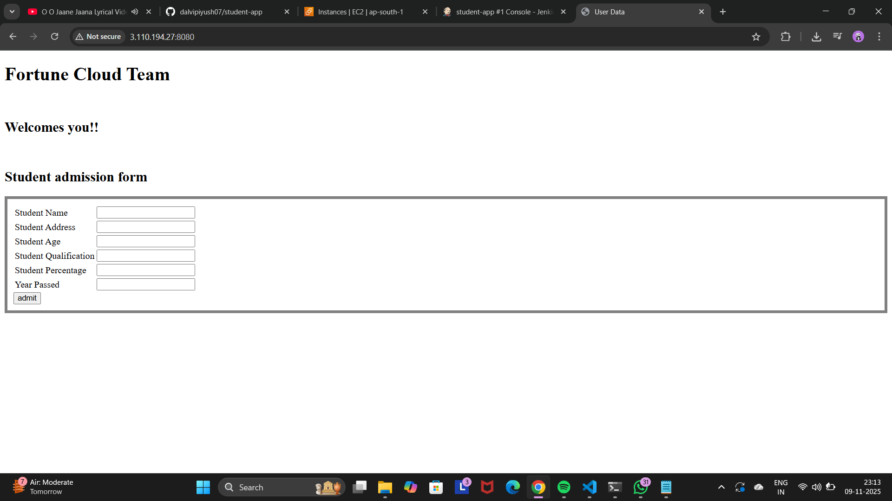
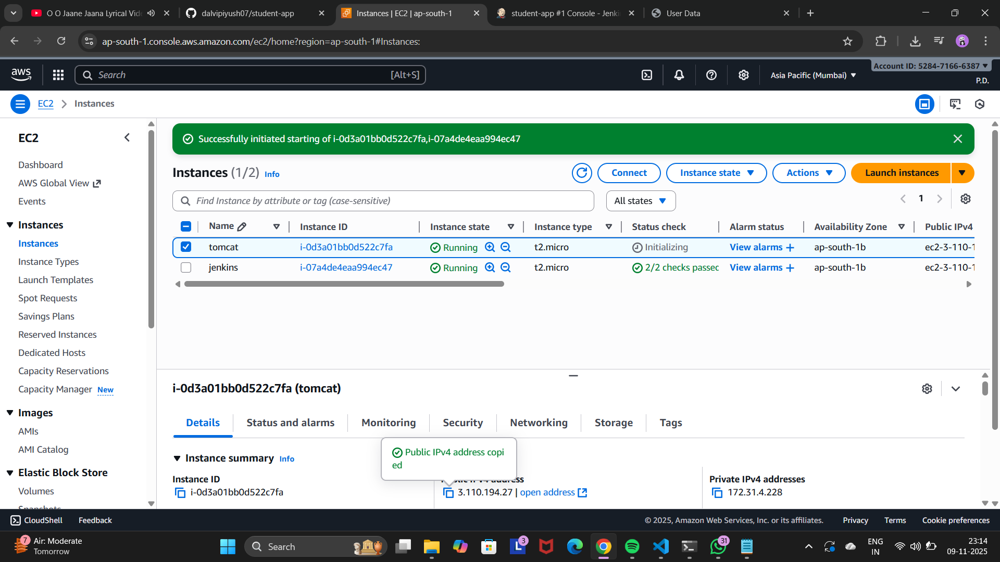
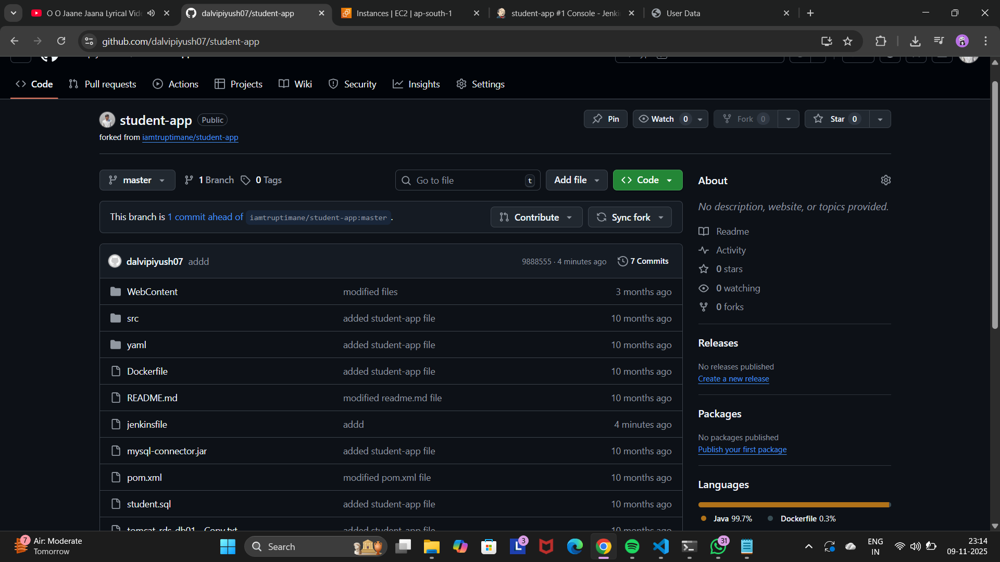
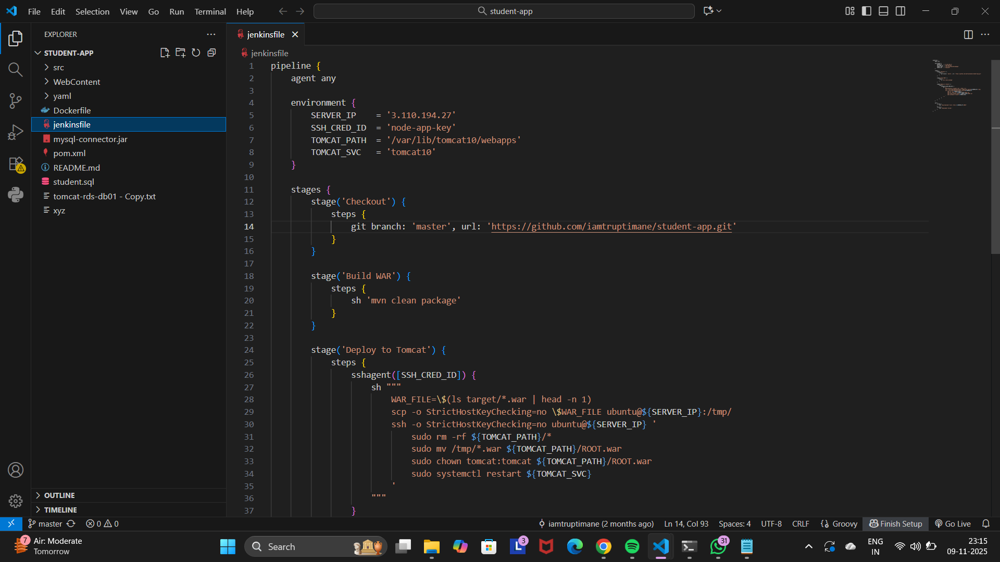

# 🎓 Student App - Complete DevOps CI/CD Project 🚀

A **Java-based Student Management Web Application** fully deployed using an **end-to-end CI/CD pipeline** built with **Git, GitHub, Jenkins, AWS EC2 (Ubuntu), Maven, and Apache Tomcat**.  

This project demonstrates how to automate the entire development and deployment process — from **code commit → build → deployment** — using Jenkins pipelines and cloud infrastructure.

---

## 🎯 Project Overview

The **Student App** allows users to enter and manage student data such as name, age, qualification, percentage, and passing year.  

This project focuses on automating deployment through **Continuous Integration and Continuous Deployment (CI/CD)** using Jenkins and AWS EC2 instances.  
It provides a real-world example of DevOps implementation for Java applications.


---

## 🧠 Objective

To create a **fully automated deployment pipeline** using Jenkins that performs the following tasks:

1. Developer clones project from GitHub and makes changes locally.  
2. Changes are pushed to a personal GitHub repository (`master` branch).  
3. Jenkins automatically detects changes and pulls the latest code.  
4. Maven builds the Java project and generates a `.war` file.  
5. Jenkins securely copies the `.war` file to a Tomcat server hosted on another EC2 instance.  
6. The web application automatically restarts and is available for access on the browser.

---

## ⚙️ Technologies Used

| Category | Tools / Technologies |
|-----------|----------------------|
| **Language** | Java |
| **Build Tool** | Maven |
| **Version Control** | Git & GitHub |
| **Automation Tool** | Jenkins |
| **Cloud Platform** | AWS EC2 (Ubuntu) |
| **Server** | Apache Tomcat 10 |
| **Pipeline Type** | Jenkins Declarative Pipeline |

---

## 🔁 CI/CD Workflow Diagram


Each stage is fully automated, ensuring zero manual deployment effort.

---

## 🧰 Jenkinsfile Explanation

Here’s the Jenkinsfile used for building and deploying the application automatically 👇

```groovy
pipeline {
    agent any

    environment {
        SERVER_IP   = '3.110.194.27'
        SSH_CRED_ID = 'node-app-key'
        TOMCAT_PATH = '/var/lib/tomcat10/webapps'
        TOMCAT_SVC  = 'tomcat10'
    }

    stages {
        stage('Checkout') {
            steps {
                echo '📥 Pulling code from GitHub repository...'
                git branch: 'master', url: 'https://github.com/dalvipiyush07/student-app.git'
            }
        }

        stage('Build WAR File') {
            steps {
                echo '🏗️ Building project using Maven...'
                sh 'mvn clean package'
            }
        }

        stage('Deploy to Tomcat Server') {
            steps {
                echo '🚀 Deploying WAR to EC2 Tomcat Server...'
                sshagent(['node-app-key']) {
                    sh '''
                    scp -o StrictHostKeyChecking=no target/*.war ubuntu@${SERVER_IP}:${TOMCAT_PATH}
                    ssh ubuntu@${SERVER_IP} 'sudo systemctl restart ${TOMCAT_SVC}'
                    '''
                }
            }
        }
    }

    post {
        success {
            echo '✅ Deployment successful! Application live on Tomcat server.'
        }
        failure {
            echo '❌ Build failed. Please check console logs for error details.'
        }
    }
}
```

---

## ☁️ AWS EC2 Setup Details

| Instance | Purpose | Configuration |
|-----------|----------|----------------|
| **EC2-1** | Jenkins Server | Ubuntu 22.04, Jenkins, Java, Maven, Git |
| **EC2-2** | Application Server | Ubuntu 22.04, Apache Tomcat 10, Java |

### 🔐 SSH Configuration
- SSH key pair `node-app-key` generated.  
- Private key added to Jenkins Credentials under “SSH Agent”.  
- Passwordless SSH established between Jenkins and Tomcat EC2 instances.

---

## 🌐 Deployment Steps Summary

1. Developer commits changes → GitHub Repository.  
2. Jenkins auto-triggers pipeline.  
3. Maven builds and generates the `.war` file.  
4. Jenkins deploys `.war` to EC2 (Tomcat).  
5. Application automatically restarts on Tomcat.  
6. Access the app in browser via:  

```
http://3.110.194.27:8080/student-app
```

---

## 🧩 Output (Deployed App)

Once deployed successfully, the app displays the **Student Admission Form**:  

Fields include:  
- Student Name  
- Address  
- Age  
- Qualification  
- Percentage  
- Year Passed  

---

## 📸 Screenshots Showcase

| Screenshot | Description |
|-------------|-------------|
|  | Deployed Student Admission Form on Tomcat |
|  | Jenkins Console Output (Build Success) |
|  | AWS EC2 Instances Running (Jenkins & Tomcat) |
|  | GitHub Repository View |
|  | Jenkinsfile opened in VS Code |

---

## 👨‍💻 Author

**Piyush Dalvi**  
💼 DevOps | Cloud | CI/CD | Java Engineer  
🌐 [GitHub Profile](https://github.com/dalvipiyush07)

---

## 🏁 Conclusion

This project demonstrates a **complete DevOps workflow** — integrating **Git, GitHub, Jenkins, Maven, AWS EC2, and Tomcat** for real-world CI/CD implementation.  

> 💡 It automates the deployment lifecycle, increases reliability, and eliminates manual effort — a core DevOps principle.  

⭐ **If you found this project helpful, don’t forget to star the repo!** ⭐
